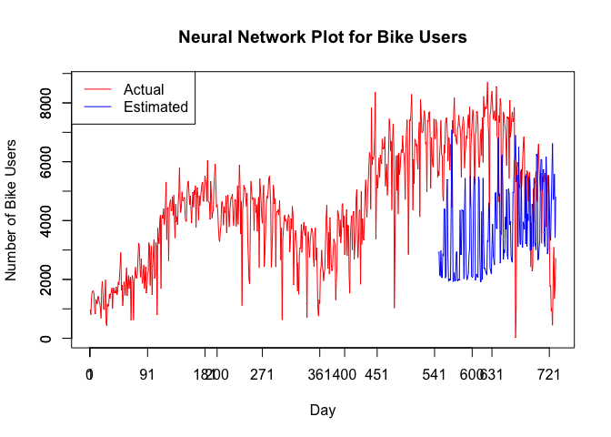

Bike Sharing Analysis
================
Vikrant Kakad

``` r
library(forecast)
library(tseries)
library(randomForest)
library(neuralnet)
```

INTRODUCTION
============

In this analysis, we will use the bike sharing dataset. The data set derived from the "UCI Machine Learning Repository".The data is related to the capital of washigton D.C. USA ridership with two-year historical log corresponding to years 2011 and 2012. We chose this dataset because bike sharing service, the new evolution of bike rentals, has become popular for recent few years. It is systems are the new generation of traditional bike rentals where the whole process from membership, rental and return back has become automatic. In this analysis, we want to predict the ridership based on other factors like weather, season, holidays etc.

``` r
temp <- tempfile()
download.file("https://archive.ics.uci.edu/ml/machine-learning-databases/00275/Bike-Sharing-Dataset.zip", temp)
day <- read.csv(unz(temp, "day.csv"), header=TRUE, stringsAsFactors=FALSE)
unlink(temp)
rm(temp)
```

DATA EXPLORATION AND PREPAREDNESS
=================================

``` r
# Data exploration
day$dteday <- as.Date(day$dteday, "%Y-%m-%d")
head(day)
```

    ##   instant     dteday season yr mnth holiday weekday workingday weathersit
    ## 1       1 2011-01-01      1  0    1       0       6          0          2
    ## 2       2 2011-01-02      1  0    1       0       0          0          2
    ## 3       3 2011-01-03      1  0    1       0       1          1          1
    ## 4       4 2011-01-04      1  0    1       0       2          1          1
    ## 5       5 2011-01-05      1  0    1       0       3          1          1
    ## 6       6 2011-01-06      1  0    1       0       4          1          1
    ##       temp    atemp      hum windspeed casual registered  cnt
    ## 1 0.344167 0.363625 0.805833 0.1604460    331        654  985
    ## 2 0.363478 0.353739 0.696087 0.2485390    131        670  801
    ## 3 0.196364 0.189405 0.437273 0.2483090    120       1229 1349
    ## 4 0.200000 0.212122 0.590435 0.1602960    108       1454 1562
    ## 5 0.226957 0.229270 0.436957 0.1869000     82       1518 1600
    ## 6 0.204348 0.233209 0.518261 0.0895652     88       1518 1606

``` r
summary(day)
```

    ##     instant          dteday               season            yr        
    ##  Min.   :  1.0   Min.   :2011-01-01   Min.   :1.000   Min.   :0.0000  
    ##  1st Qu.:183.5   1st Qu.:2011-07-02   1st Qu.:2.000   1st Qu.:0.0000  
    ##  Median :366.0   Median :2012-01-01   Median :3.000   Median :1.0000  
    ##  Mean   :366.0   Mean   :2012-01-01   Mean   :2.497   Mean   :0.5007  
    ##  3rd Qu.:548.5   3rd Qu.:2012-07-01   3rd Qu.:3.000   3rd Qu.:1.0000  
    ##  Max.   :731.0   Max.   :2012-12-31   Max.   :4.000   Max.   :1.0000  
    ##       mnth          holiday           weekday        workingday   
    ##  Min.   : 1.00   Min.   :0.00000   Min.   :0.000   Min.   :0.000  
    ##  1st Qu.: 4.00   1st Qu.:0.00000   1st Qu.:1.000   1st Qu.:0.000  
    ##  Median : 7.00   Median :0.00000   Median :3.000   Median :1.000  
    ##  Mean   : 6.52   Mean   :0.02873   Mean   :2.997   Mean   :0.684  
    ##  3rd Qu.:10.00   3rd Qu.:0.00000   3rd Qu.:5.000   3rd Qu.:1.000  
    ##  Max.   :12.00   Max.   :1.00000   Max.   :6.000   Max.   :1.000  
    ##    weathersit         temp             atemp              hum        
    ##  Min.   :1.000   Min.   :0.05913   Min.   :0.07907   Min.   :0.0000  
    ##  1st Qu.:1.000   1st Qu.:0.33708   1st Qu.:0.33784   1st Qu.:0.5200  
    ##  Median :1.000   Median :0.49833   Median :0.48673   Median :0.6267  
    ##  Mean   :1.395   Mean   :0.49538   Mean   :0.47435   Mean   :0.6279  
    ##  3rd Qu.:2.000   3rd Qu.:0.65542   3rd Qu.:0.60860   3rd Qu.:0.7302  
    ##  Max.   :3.000   Max.   :0.86167   Max.   :0.84090   Max.   :0.9725  
    ##    windspeed           casual         registered        cnt      
    ##  Min.   :0.02239   Min.   :   2.0   Min.   :  20   Min.   :  22  
    ##  1st Qu.:0.13495   1st Qu.: 315.5   1st Qu.:2497   1st Qu.:3152  
    ##  Median :0.18097   Median : 713.0   Median :3662   Median :4548  
    ##  Mean   :0.19049   Mean   : 848.2   Mean   :3656   Mean   :4504  
    ##  3rd Qu.:0.23321   3rd Qu.:1096.0   3rd Qu.:4776   3rd Qu.:5956  
    ##  Max.   :0.50746   Max.   :3410.0   Max.   :6946   Max.   :8714

``` r
# Split 
train_df <- day[1:547, ]
test_df <- day[547:nrow(day), ]
```

TIME SERIES ANALYSIS
====================

Spliting data into training and testing sets. Took 90% of data for the training set and rest of 10% for the testing. The plot shows the trend of the data. The time series described an additive model since the random fluctuations in the data are roughly constant in size over time.

``` r
data_ts <-msts(day[,'cnt'], seasonal.periods=c(7))
train_ts <- head(data_ts, round(length(data_ts) * 0.9))
test_ts <- tail(data_ts, round(length(data_ts) * 0.1))
plot(train_ts, xlab="Weeks", ylab="Bike riders")
```


### Decomposition

The decomposition plot below shows the original time series on top, the estimated trend component, the estimated seasonal component, and the estimated remainder component. We can see, there is a very strong seasonality over the weeks.

``` r
plot(decompose(train_ts, type='add'), xlab="Weeks")
```


### Test for Stationarity

Fitting an ARIMA model requires the series to be stationary (Dalinina, n.d.). So, I checked the stationarity of the series by used ADF test (Augmented Dickey-Fuller). The test shows that the p-value is .19, which indicates series is non-stationary.

``` r
adf_test <- adf.test(train_ts, alternative='stationary')
print(adf_test)
```

    ## 
    ##  Augmented Dickey-Fuller Test
    ## 
    ## data:  train_ts
    ## Dickey-Fuller = -2.8989, Lag order = 8, p-value = 0.1978
    ## alternative hypothesis: stationary

### ACF and PACF for seasonal series

Here are the ACF and PACF plots for the series. We can estimate the seasonal MA from ACF and AR from PACF for this series. Looking at the plots we can say that this is an 'Auto Regressive'(AR) type of series (Minitab, n.d). Thus the order will be AR(6) and MA(0).

``` r
acf_ts <- acf(train_ts[1:length(train_ts)], plot = FALSE)
plot(acf_ts,  main = "Autocorrelation function")
```


``` r
pacf_ts <- pacf(train_ts[1:length(train_ts)], plot = FALSE)
plot(pacf_ts,  main = " Partial autocorrelation function")
```


### Non-Stationary to Stationary by Seasonal Difference

Differencing method is one of the methods to convert non-stationary series to the stationary one. Usually, non-stationary series can be corrected by a simple transformation; differencing. Differencing the series can help in removing its trend or cycles. The idea behind differencing is that, if the original data series does not have constant properties over time, then the change from one period to another might (Dalinina, n.d.). After plotting the differenced series, we see an oscillating pattern and no visible strong trend. This suggests that differencing of order 1 terms is sufficient and should be included in the model.

``` r
stat_diff <- diff(train_ts, differences = 1)
plot(stat_diff, main = " Seasonal Difference", xlab= "Weeks")
```


``` r
adf_test <- adf.test(stat_diff, alternative = 'stationary')
```

    ## Warning in adf.test(stat_diff, alternative = "stationary"): p-value smaller
    ## than printed p-value

``` r
adf_test 
```

    ## 
    ##  Augmented Dickey-Fuller Test
    ## 
    ## data:  stat_diff
    ## Dickey-Fuller = -13.611, Lag order = 8, p-value = 0.01
    ## alternative hypothesis: stationary

### ACF and PACF for non seasonal series

We can estimate the non-seasonal MA from ACF and AR from PACF for this series. Looking at the plots we can say that this is an 'Auto Regressive'(AR) type of series (Minitab, n.d). Thus the order will be AR(7) and MA(0).

``` r
acf_ts <- acf(stat_diff[1:length(stat_diff)], plot = FALSE)
plot(acf_ts,  main = "Autocorrelation function")
```


``` r
pacf_ts <- pacf(stat_diff[1:length(stat_diff)], plot = FALSE)
plot(pacf_ts,  main = " Partial autocorrelation function")
```


### ARIMA Forecasting

We fitted a model with the order(7,1,0) and seasonal(6,1,0) with period 7 weeks. Forecasts from the model for the next 10 weeks are also shown in the plot below. The forecasts follow the recent trend in the data, because of the differencing. We can see that the forecast is not very close to the actual data(blue line). We can say that this is not a very reasonable model and can not be used for decisions making because of others factors are not considers weather, temperature etc.

``` r
fit1 <- Arima(train_ts, order=c(7,1,0),seasonal=c(6,1,0), method = "CSS", optim.method = "BFGS")
forecast_ts <- forecast(fit1,h= length(test_ts))
autoplot(forecast_ts, xlab="Weeks", ylab= "Bike Riders") + autolayer(test_ts)
```


``` r
accuracy(forecast_ts, test_ts)
```

    ##                        ME     RMSE       MAE         MPE      MAPE
    ## Training set    -7.577805  888.944  615.5461   -6.527716  19.03185
    ## Test set     -1113.720379 2017.768 1517.1759 -442.716130 448.68648
    ##                   MASE          ACF1 Theil's U
    ## Training set 0.7127392 -0.0002364113        NA
    ## Test set     1.7567340  0.6449960509  4.432097

RANDOM FOREST
=============

Random forests are a gathering learning strategy for classification, regression and different undertakings, that work by building a huge number of choice trees at preparing time and yielding the class that is the method of the classes or order or mean forecast of regression of the individual trees.

Here, we prediction of the number of bike users are closer than the previous model.

#### Random Forest model with default parameters(without temperature variable)

``` r
# Create a Random Forest model with default parameters
rf_model1 <- randomForest(cnt ~ workingday + season + yr + mnth, data = train_df, ntree = 10)
print(rf_model1)
```

    ## 
    ## Call:
    ##  randomForest(formula = cnt ~ workingday + season + yr + mnth,      data = train_df, ntree = 10) 
    ##                Type of random forest: regression
    ##                      Number of trees: 10
    ## No. of variables tried at each split: 1
    ## 
    ##           Mean of squared residuals: 1194787
    ##                     % Var explained: 59.14

``` r
predTrain <- predict(rf_model1, test_df, type = "class")
plot(day$instant, day$cnt, type = "l", col = "red", xlab = "Day", ylab = "Number of Bike Users", main = "Random Forest Plot for Bike Users")
legend("topleft", c("Actual", "Estimated"), lty = c(1, 1), col = c("red", "blue"))
lines(test_df$instant, predTrain, type = "l", col = "blue")
```


``` r
rm(predTrain, rf_model1)
```

#### Random Forest model with default parameters(with temperature variable)

``` r
# Create a Random Forest model with default parameters(with temperature)

rf_model2 <- randomForest(cnt ~ temp + season + yr + mnth, data = train_df, ntree = 10)
print(rf_model2)
```

    ## 
    ## Call:
    ##  randomForest(formula = cnt ~ temp + season + yr + mnth, data = train_df,      ntree = 10) 
    ##                Type of random forest: regression
    ##                      Number of trees: 10
    ## No. of variables tried at each split: 1
    ## 
    ##           Mean of squared residuals: 789428.5
    ##                     % Var explained: 73.01

``` r
# Predicting on test set
predTrain <- predict(rf_model2, test_df, type = "class")

# Visualizing the Random Forest Plot
plot(day$instant, day$cnt, type = "l", col = "red", xlab = "Day", ylab = "Number of Bike Users", main = "Random Forest Plot for Bike Users")
legend("topleft", c("Actual", "Estimated"), lty = c(1, 1), col = c("red", "blue"))
lines(test_df$instant, predTrain, type = "l", col = "blue")
```


``` r
rm(predTrain, rf_model2)
```

NEURAL NETWORK
==============

A neural network is a progression of algorithms that undertakings to perceive basic connections in an arrangement of information through a procedure that emulates the manner in which the human cerebrum works. Neural networks can adjust to changing info so the network produces the most ideal outcome without expecting to update the yield criteria.

### Scaling and Splitting the Dataset

``` r
# Removing non-numeric & redundant columns
df <- day
day$dteday <- NULL
day$instant <- NULL
day$weekday <- NULL
day$temp <- NULL

# Scalling the dataset
d_max <- apply(day, 2, max)
d_min <- apply(day, 2, min)

scaled <- as.data.frame(scale(day, center = d_min, scale = d_max - d_min))

train_nn_df <- scaled[1:547, ]
test_nn_df <- scaled[547:nrow(scaled), ]
```

### Neural Network (without temperature variable)

#### Building the Model

``` r
# fit neural network with few parameters
set.seed(2)
nn_model1 = neuralnet(cnt ~ season + yr + mnth + workingday + holiday, train_nn_df)

# plot neural network
plot(nn_model1)
```

#### Visualizing the Neural Network Plot

``` r
# Predict the values using compute() function
nn_predict = compute(nn_model1, test_nn_df[ , c(1:5)])
nn_predict = (nn_predict$net.result * (max(day$cnt) - min(day$cnt))) + min(day$cnt)

# Visualizing the Neural Network Plot
plot(df$instant, df$cnt, type = "l", col = "red", xlab = "Day", ylab = "Number of Bike Users", main = "Neural Network Plot for Bike Users")
legend("topleft", c("Actual", "Estimated"), lty = c(1, 1), col = c("red", "blue"))
lines(test_df$instant, nn_predict, type = "l", col = "blue")
axis(side=1, at = seq(1, 731, by = 90))
axis(side=2, at=seq(0, 10000, 1000))
```


### Neural Network (with temperature variable)

#### Building the Model

``` r
nn_model = neuralnet(cnt ~ season + yr + mnth + workingday + weathersit + atemp + hum + windspeed, train_nn_df)

# plot neural network
plot(nn_model)

# Predict the values using compute() function
nn_predict = compute(nn_model, test_nn_df[ , c(1:8)])
nn_predict = (nn_predict$net.result * (max(day$cnt) - min(day$cnt))) + min(day$cnt)
```

#### Visualizing the Neural Network Plot

``` r
# Visualizing the Neural Network Plot
plot(df$instant, df$cnt, type = "l", col = "red", xlab = "Day", ylab = "Number of Bike Users", main = "Neural Network Plot for Bike Users")
legend("topleft", c("Actual", "Estimated"), lty = c(1, 1), col = c("red", "blue"))
lines(test_df$instant, nn_predict, type = "l", col = "blue")
axis(side=1, at = seq(1, 731, by = 90))
axis(side=2, at=seq(0, 10000, 1000))
```



CONCLUSION
==========

Concluding the series of machine learning algorithms used, we learned and adapted the techniques like time series modeling implementation, random forest application and neural network methodology. The resultant of the time series forecasting model was not very close to the actual data where as the calculations of random forest somewhat matched the actual data (not completely). The use of neural network applications on the data gave us quite good result and we could determine the undertakings of the perceived basic connections properly in predicting the result.

REFERENCES
==========

Fanaee-T, Hadi, and Gama, Joao, "Event labeling combining ensemble detectors and background knowledge", Progress in Artificial Intelligence (2013): pp. 1-15, Springer Berlin Heidelberg, <doi:10.1007/s13748-013-0040-3>.
